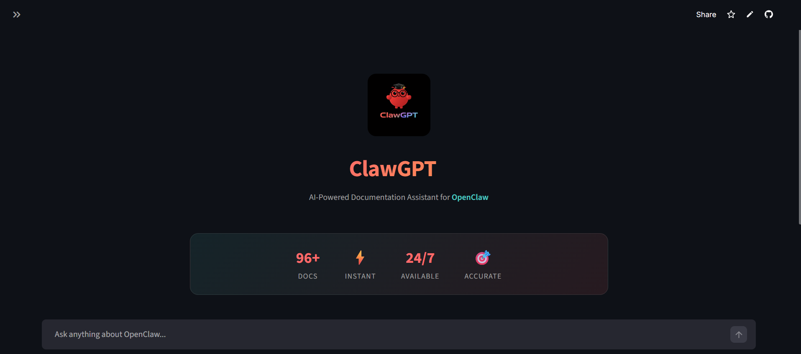

# ClawGPT 🦞

[](https://clawgpt.streamlit.app)

**AI-Powered Documentation Assistant for OpenClaw** - Get instant, intelligent answers about OpenClaw features, installation, configuration, and troubleshooting.



## ✨ Features

- **🧠 RAG-Powered Q&A** - Retrieval-Augmented Generation for accurate, context-aware answers
- **⚡ Instant Responses** - Pre-built embeddings for lightning-fast query processing
- **🎯 Source Attribution** - See exactly which documentation pages inform each answer
- **💬 Chat Interface** - Natural conversation with chat history
- **🔍 Semantic Search** - Find relevant information even with imprecise queries
- **📱 Responsive Design** - Works beautifully on desktop and mobile

## 🛠️ Tech Stack

- **LLM**: Google Gemini 2.0 Flash
- **Embeddings**: Gemini Embedding 001
- **Vector Database**: ChromaDB
- **Frontend**: Streamlit
- **Framework**: LangChain

## 🚀 Quick Start

### Prerequisites

- Python 3.9+
- Gemini API Key ([Get one here](https://makersuite.google.com/app/apikey))

### Installation

1. **Clone the repository**
   ```bash
   git clone https://github.com/yourusername/ClawGPT.git
   cd ClawGPT
   ```

2. **Create virtual environment**
   ```bash
   python -m venv venv

   # Windows
   venv\Scripts\activate

   # macOS/Linux
   source venv/bin/activate
   ```

3. **Install dependencies**
   ```bash
   pip install -r requirements.txt
   ```

4. **Configure environment**
   ```bash
   cp .env.example .env
   # Edit .env and add your GEMINI_API_KEY
   ```

5. **Generate embeddings** (one-time setup)
   ```bash
   python create_embeddings.py
   ```

6. **Run the application**
   ```bash
   streamlit run app.py
   ```

Visit `http://localhost:8501` to start chatting!

## 📁 Project Structure

```
ClawGPT/
├── app.py                 # Main Streamlit application
├── create_embeddings.py   # Script to generate vector embeddings
├── requirements.txt       # Python dependencies
├── .env                   # Environment variables (not tracked)
├── .env.example           # Environment template
├── .gitignore             # Git ignore rules
├── assets/                # Static assets
│   └── logo.png           # Application logo
├── pdfs/                  # OpenClaw documentation (markdown files)
├── chroma_db/             # Vector store (generated)
└── README.md              # This file
```

## 🔧 Configuration

### Environment Variables

| Variable | Description | Required |
|----------|-------------|----------|
| `GEMINI_API_KEY` | Google Gemini API key | Yes |

### Customization

- **Adjust context chunks**: Use the sidebar slider (3-10)
- **Toggle sources**: Show/hide source documents
- **Add logo**: Place your logo at `assets/logo.png`

## 📊 How It Works

```
┌─────────────────┐    ┌──────────────────┐    ┌─────────────────┐
│   User Query    │───▶│  Semantic Search │───▶│ Relevant Chunks │
└─────────────────┘    │   (ChromaDB)     │    └────────┬────────┘
                       └──────────────────┘             │
                                                        ▼
┌─────────────────┐    ┌──────────────────┐    ┌─────────────────┐
│    Response     │◀───│   Gemini 2.0     │◀───│  Context + Query│
└─────────────────┘    │     Flash        │    └─────────────────┘
                       └──────────────────┘
```

1. **Document Processing**: Markdown files are loaded and split into chunks
2. **Embedding Generation**: Each chunk is converted to a vector using Gemini Embedding
3. **Vector Storage**: Embeddings are stored in ChromaDB for fast retrieval
4. **Query Processing**: User questions are embedded and matched against stored vectors
5. **Response Generation**: Relevant chunks + query are sent to Gemini 2.0 Flash for response

## 🌐 Deployment

### Streamlit Cloud

1. Push to GitHub
2. Connect to [Streamlit Cloud](https://streamlit.io/cloud)
3. Add `GEMINI_API_KEY` to secrets
4. Deploy!

### Docker

```dockerfile
FROM python:3.11-slim
WORKDIR /app
COPY requirements.txt .
RUN pip install -r requirements.txt
COPY . .
CMD ["streamlit", "run", "app.py", "--server.port=8501"]
```

## 📈 SEO & Discoverability

ClawGPT is optimized for search engines with:
- Semantic HTML structure
- OpenGraph meta tags
- Twitter Card support
- Descriptive page titles
- Canonical URLs

## 🤝 Contributing

Contributions are welcome! Please feel free to submit a Pull Request.

## 📄 License

This project is for educational purposes.

## 🔗 Links

- [OpenClaw GitHub](https://github.com/openclaw/openclaw)
- [OpenClaw Documentation](https://docs.openclaw.ai)
- [Discord Community](https://discord.com/invite/clawd)

---

<p align="center">
  Made with ❤️ | Powered by Google Gemini 2.0
</p>
